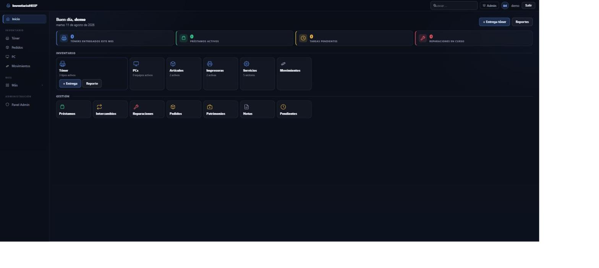
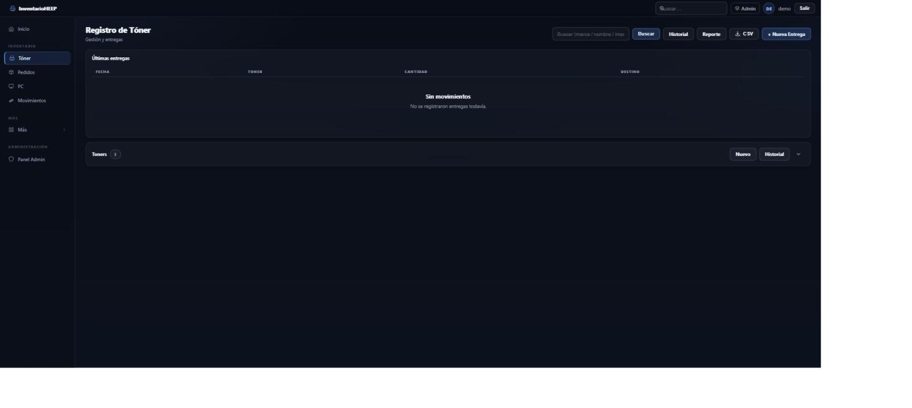

# StockToner — Sistema de Inventario de Insumos IT

Aplicación de **escritorio** para gestionar el inventario de insumos informáticos de una
organización: tóners, artículos, PCs, impresoras, préstamos, reparaciones, pedidos y
movimientos, con historial y reportes. Backend Django corriendo embebido, con interfaz nativa
de escritorio (sin depender de un navegador externo) y también utilizable como app web normal
en desarrollo.

> Nota: las capturas y datos de ejemplo de este README son ficticios — la app se usa en
> producción para gestión real de inventario, y esos datos no se publican.

## El problema que resuelve

Llevar el inventario de insumos de IT (tóners, PCs, impresoras) en planillas sueltas hace
difícil saber qué stock queda, a quién se le prestó un equipo, qué reparación está en curso o
qué se pidió y no llegó. StockToner centraliza todo eso en un solo sistema con historial y
trazabilidad.

## Funcionalidades

- **Dashboard** con accesos rápidos y contadores (tóners entregados en el mes, préstamos
  activos, tareas pendientes, reparaciones en curso).
- **Tóner**: registro de entregas, historial, exportación a CSV.
- **Artículos, PCs, Impresoras**: alta, edición y seguimiento de equipamiento.
- **Servicios**: catálogo de sectores/áreas de destino.
- **Movimientos**: trazabilidad de entregas y traslados.
- **Préstamos, Intercambios, Reparaciones, Pedidos, Patrimonios, Notas, Pendientes**: módulos
  de gestión completa del ciclo de vida del inventario.
- **Panel de administración** de Django para gestión avanzada.
- **Reportes** exportables.

## Capturas

| Dashboard | Tóner |
|---|---|
|  |  |

## Arquitectura

Es un proyecto **Django** que se puede correr de dos formas:

1. **Como app web normal** (`python manage.py runserver`) — útil para desarrollo.
2. **Como app de escritorio** (`desktop_app.py`), usando `pywebview` para mostrar la interfaz
   en una ventana nativa, con el servidor Django (`waitress`) corriendo embebido en el mismo
   proceso. Se empaqueta como ejecutable standalone con PyInstaller (`StockToner.spec`).

```
config/            # settings, urls (proyecto Django)
inventario/         # app principal: modelos, vistas, forms, templates
  forms/             # un archivo de formulario por entidad
  fixtures/           # datos de ejemplo para `manage.py seed`
  tests.py            # 70 tests
desktop_app.py       # punto de entrada de la app de escritorio (pywebview + waitress)
manage.py             # punto de entrada estándar de Django (desarrollo)
StockToner.spec        # configuración de PyInstaller para el build del .exe
```

- La `SECRET_KEY` se genera una única vez por instalación y se persiste en la carpeta de datos
  de la aplicación (no se hardcodea ni se versiona).
- `DEBUG` se desactiva automáticamente cuando la app corre empaquetada (`.exe`), y solo puede
  forzarse con una variable de entorno explícita.
- Los datos (base SQLite, backups) se guardan en la carpeta de datos de la aplicación del
  sistema operativo, separada del código — nunca en el repo.

## Proceso de diseño

Antes de escribir el primer modelo se armó un [documento de diseño](docs/modelo-de-datos.pdf) con
las entidades, reglas de negocio y decisiones de estructura, y un
[mockup temprano de la UI](docs/mockup-ui.png) para validar la estética de escritorio antes de
implementarla.

## Stack

- **Backend:** Django 5.2
- **Servidor embebido:** waitress + whitenoise (estáticos)
- **App de escritorio:** pywebview
- **Empaquetado:** PyInstaller
- **Base de datos:** SQLite

## Instalación y ejecución local

```bash
git clone https://github.com/bereail/stockTonerDesktop.git
cd stockTonerDesktop

python -m venv venv
venv\Scripts\activate        # Windows

pip install -r requirements.txt
python manage.py migrate
python manage.py seed          # carga servicios y tóners de ejemplo (no hace nada si ya hay datos)
python manage.py createsuperuser

python manage.py runserver
```

Para correr como app de escritorio: `python desktop_app.py`.

### Explorar con datos de ejemplo

Para ver la app con todos los módulos ya cargados (stock con historial, préstamos activos y
vencidos, pedidos en distintos estados, reparaciones, intercambios, etc.), sin necesidad de
cargar nada a mano:

```bash
python manage.py seed_demo
```

Genera datos 100% ficticios (no pisa nada si ya hay pedidos cargados) y, si no existe ningún
superusuario, crea uno de prueba (`demo` / `demo1234`) solo para uso local.

## Testing

**70 tests automatizados**, cubriendo modelos y flujos principales:

```bash
python manage.py test inventario
```

## Notas sobre el historial de este repositorio

El repositorio tuvo, en versiones anteriores, el entorno virtual de Python y los artefactos
de build de PyInstaller versionados por error (miles de archivos). Se limpió por completo del
historial de git antes de publicar este repo.

## Licencia

[MIT](LICENSE)
